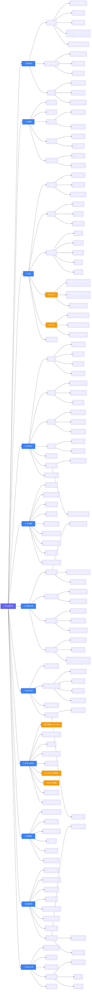

```mermaid
graph LR
    %% ===== 根节点 =====
    CSS["🎨 CSS 知识树"]

    %% ===== 一级分支 =====
    CSS --> Basic["① 基础语法"]
    CSS --> Box["② 盒模型"]
    CSS --> Layout["③ 布局"]
    CSS --> Visual["④ 视觉样式"]
    CSS --> Typo["⑤ 文字排版"]
    CSS --> Anim["⑥ 动画与过渡"]
    CSS --> Responsive["⑦ 响应式设计"]
    CSS --> Modern["⑧ 现代CSS特性"]
    CSS --> Advanced["⑨ 高级概念"]
    CSS --> Practice["⑩ 最佳实践"]
    CSS --> Tools["⑪ 调试与工具"]

    %% ===== ① 基础语法 =====
    Basic --> Sel["选择器"]
    Basic --> Cascade["层叠与优先级"]
    Basic --> Units["单位"]

    Sel --> SelBasic["元素/类/ID/通配符"]
    Sel --> SelAttr["属性选择器"]
    Sel --> SelCombo["组合选择器"]
    Sel --> SelPseudo["伪类 & 伪元素  :hover ::before"]
    Sel --> SelStruct["结构伪类  :nth-child :not"]

    Cascade --> Inherit["继承 inherit/initial"]
    Cascade --> Specificity["优先级计算"]
    Cascade --> Important["!important"]

    Units --> Abs["绝对 px/pt/cm"]
    Units --> RelFont["相对 em/rem"]
    Units --> Viewport["视口 vw/vh/vmin"]

    %% ===== ② 盒模型 =====
    Box --> Content["content"]
    Box --> Padding["padding"]
    Box --> Border["border"]
    Box --> Margin["margin"]
    Box --> Sizing["box-sizing"]

    Border --> BorderRadius["border-radius"]
    Border --> BorderImg["border-image"]
    Margin --> MarginCollapse["margin 折叠"]
    Margin --> NegMargin["负 margin"]
    Sizing --> ContentBox["content-box"]
    Sizing --> BorderBox["border-box ★"]

    %% ===== ③ 布局 =====
    Layout --> Display["display"]
    Layout --> Float["float"]
    Layout --> Position["position"]
    Layout --> Flex["Flexbox ★"]
    Layout --> Grid["Grid ★★"]
    Layout --> MultiCol["多列布局"]

    Display --> Block["block / inline"]
    Display --> InlineBlock["inline-block"]
    Display --> None["none / contents"]

    Float --> FloatLR["left / right"]
    Float --> Clearfix["clearfix"]
    Float --> BFC["BFC 触发"]

    Position --> Static["static"]
    Position --> Relative["relative"]
    Position --> Absolute["absolute"]
    Position --> Fixed["fixed"]
    Position --> Sticky["sticky"]

    Flex --> FlexContainer["容器: justify-content / align-items"]
    Flex --> FlexItem["项目: flex-grow / shrink / basis"]
    Flex --> FlexDir["flex-direction / wrap"]

    Grid --> GridContainer["容器: grid-template / gap"]
    Grid --> GridItem["项目: grid-column / area"]
    Grid --> GridArea["grid-template-areas"]

    %% ===== ④ 视觉样式 =====
    Visual --> Color["颜色"]
    Visual --> Background["背景"]
    Visual --> Gradient["渐变"]
    Visual --> Shadow["阴影"]
    Visual --> Filter["滤镜 filter"]
    Visual --> Blend["混合模式"]
    Visual --> Clip["裁剪 clip-path"]

    Color --> Hex["十六进制 #fff"]
    Color --> RGB["rgb / rgba"]
    Color --> HSL["hsl / hsla"]
    Color --> CurrentColor["currentColor"]

    Background --> BgImg["background-image"]
    Background --> BgSize["background-size"]
    Background --> BgMulti["多重背景"]

    Gradient --> Linear["linear-gradient"]
    Gradient --> Radial["radial-gradient"]
    Gradient --> Conic["conic-gradient"]

    Shadow --> BoxShadow["box-shadow"]
    Shadow --> TextShadow["text-shadow"]

    Blend --> MixBlend["mix-blend-mode"]
    Blend --> BgBlend["background-blend-mode"]

    %% ===== ⑤ 文字排版 =====
    Typo --> FontFamily["font-family"]
    Typo --> FontSize["font-size / weight"]
    Typo --> LineHeight["line-height"]
    Typo --> TextAlign["text-align"]
    Typo --> Decoration["text-decoration"]
    Typo --> Spacing["letter / word-spacing"]
    Typo --> Overflow["text-overflow ellipsis"]
    Typo --> FontFace["@font-face"]
    Typo --> WhiteSpace["white-space nowrap"]

    %% ===== ⑥ 动画与过渡 =====
    Anim --> Transition["transition"]
    Anim --> Keyframes["@keyframes"]
    Anim --> Animation["animation"]
    Anim --> Transform["transform"]

    Transition --> TransProp["transition-property"]
    Transition --> TransTime["timing-function  cubic-bezier"]
    Transition --> TransDur["duration / delay"]

    Keyframes --> KeyframeRule["@keyframes name"]
    Keyframes --> KeyframePct["0% / 50% / 100%"]

    Animation --> AnimName["animation-name"]
    Animation --> AnimIter["iteration-count"]
    Animation --> AnimDir["direction / fill-mode"]

    Transform --> Translate["translate / rotate"]
    Transform --> Scale["scale / skew"]
    Transform --> Transform3D["3D transform  perspective / translateZ"]

    %% ===== ⑦ 响应式设计 =====
    Responsive --> ViewportMeta["viewport meta"]
    Responsive --> MediaQuery["@media 媒体查询"]
    Responsive --> MobileFirst["移动优先策略"]
    Responsive --> ResponsiveImg["响应式图片"]

    MediaQuery --> MQWidth["min / max-width"]
    MediaQuery --> MQRatio["aspect-ratio"]
    MediaQuery --> MQOrient["orientation"]
    MediaQuery --> MQHover["hover / pointer"]

    ResponsiveImg --> Srcset["srcset / sizes"]
    ResponsiveImg --> Picture["picture 元素"]

    %% ===== ⑧ 现代CSS特性 =====
    Modern --> CSSVar["自定义属性  --var / var()"]
    Modern --> Supports["@supports 特性查询"]
    Modern --> Calc["calc()"]
    Modern --> MinMaxClamp["min / max / clamp()"]
    Modern --> AspectRatio["aspect-ratio"]
    Modern --> ContainerQuery["@container 容器查询"]
    Modern --> HasSel[":has() 父选择器"]
    Modern --> CascadeLayer["@layer 层叠层"]
    Modern --> ColorMix["color-mix / contrast"]

    %% ===== ⑨ 高级概念 =====
    Advanced --> BFCConcept["BFC 块级格式上下文"]
    Advanced --> IFCConcept["IFC 行内格式"]
    Advanced --> Stacking["层叠上下文 z-index"]
    Advanced --> ContainBlock["包含块"]
    Advanced --> Reflow["重绘与回流"]
    Advanced --> FormatModel["视觉格式化模型"]

    %% ===== ⑩ 最佳实践 =====
    Practice --> BEM["BEM 命名规范"]
    Practice --> OOCSS["OOCSS / SMACSS"]
    Practice --> CSSMod["CSS Modules"]
    Practice --> CSSinJS["CSS-in-JS"]
    Practice --> Utility["Tailwind / Utility-first"]
    Practice --> Reset["reset / normalize"]
    Practice --> Prefix["浏览器前缀"]
    Practice --> Perf["性能优化"]

    Perf --> CritCSS["关键CSS内联"]
    Perf --> NoImport["避免 @import"]
    Perf --> WillChange["will-change"]

    %% ===== ⑪ 调试与工具 =====
    Tools --> DevTools["浏览器 DevTools"]
    Tools --> PostCSS["PostCSS"]
    Tools --> AutoPrefix["Autoprefixer"]
    Tools --> PreProc["预处理器"]
    Tools --> Lint["Stylelint"]

    PreProc --> Sass["Sass / SCSS"]
    PreProc --> Less["Less"]
    PreProc --> Stylus["Stylus"]

    %% ===== 样式高亮 =====
    classDef root fill:#6366f1,stroke:#4338ca,color:#fff,stroke-width:3px
    classDef level1 fill:#3b82f6,stroke:#2563eb,color:#fff,stroke-width:2px
    classDef hot fill:#f59e0b,stroke:#d97706,color:#fff

    class CSS root
    class Basic,Box,Layout,Visual,Typo,Anim,Responsive,Modern,Advanced,Practice,Tools level1
    class Flex,Grid,ContainerQuery,HasSel,CSSVar hot
```
