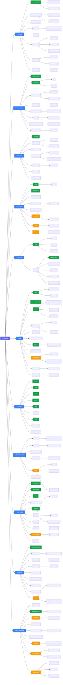

```mermaid
graph LR
    %% ===== 根节点 =====
    HTML["HTML 知识树"]

    %% ===== 一级分支 =====
    HTML --> Basic["① 文档基础"]
    HTML --> Text["② 文本与内容语义"]
    HTML --> Link["③ 链接与导航"]
    HTML --> Image["④ 图片与图形"]
    HTML --> Data["⑤ 列表与表格"]
    HTML --> Form["⑥ 表单"]
    HTML --> Semantic["⑦ 语义化布局"]
    HTML --> Media["⑧ 多媒体与嵌入内容"]
    HTML --> Metadata["⑨ head 与元数据"]
    HTML --> A11y["⑩ 可访问性"]
    HTML --> Quality["⑪ 规范、调试与质量"]

    %% ===== ① 文档基础 =====
    Basic --> Skeleton["HTML 文档骨架"]
    Basic --> Syntax["标签、元素与属性"]
    Basic --> Nesting["嵌套与父子关系"]
    Basic --> Void["空元素"]
    Basic --> Comment["注释"]
    Basic --> GlobalAttr["全局属性"]
    Basic --> Path["资源路径"]
    Basic --> Entity["字符实体"]

    Skeleton --> Doctype["&lt;!DOCTYPE html&gt;"]
    Skeleton --> HtmlTag["html / head / body"]
    Syntax --> StartEnd["开始标签 / 结束标签"]
    Syntax --> AttrValue["属性名 / 属性值"]
    Void --> VoidTags["img / input / br / hr / meta / link"]
    GlobalAttr --> IdClass["id / class"]
    GlobalAttr --> TitleAttr["title / hidden"]
    GlobalAttr --> DataAttr["data-* 自定义数据"]
    Path --> AbsolutePath["绝对 URL"]
    Path --> RelativePath["相对路径 ./ ../"]
    Entity --> CommonEntity["&lt; / &gt; / &amp; / &nbsp;"]

    %% ===== ② 文本与内容语义 =====
    Text --> Heading["标题层级 h1-h6"]
    Text --> Paragraph["段落与分隔"]
    Text --> Emphasis["强调与重要性"]
    Text --> Edit["编辑标记"]
    Text --> CodeText["代码与预格式文本"]
    Text --> Quote["引用"]
    Text --> Meaning["时间、缩写与联系信息"]
    Text --> Generic["无特定语义容器"]

    Paragraph --> PTag["p"]
    Paragraph --> BrHr["br / hr"]
    Emphasis --> StrongEm["strong / em"]
    Emphasis --> BI["b / i / mark / small"]
    Edit --> DelIns["del / ins"]
    CodeText --> CodePre["code / pre / kbd / samp"]
    Quote --> BlockInlineQuote["blockquote / q / cite"]
    Meaning --> TimeAbbr["time / abbr / address"]
    Generic --> DivSpan["div / span"]

    %% ===== ③ 链接与导航 =====
    Link --> Anchor["a 与 href"]
    Link --> LinkPath["链接地址"]
    Link --> Fragment["页内锚点 #id"]
    Link --> NewWindow["新窗口与安全"]
    Link --> Protocol["特殊协议"]
    Link --> Download["下载链接"]
    Link --> NavTag["nav 导航区域"]

    LinkPath --> ExternalLink["外部链接"]
    LinkPath --> InternalLink["站内相对链接"]
    NewWindow --> TargetBlank["target=_blank"]
    NewWindow --> RelNoopener["rel=noopener noreferrer"]
    Protocol --> MailTel["mailto: / tel:"]

    %% ===== ④ 图片与图形 =====
    Image --> Img["img"]
    Image --> Alt["替代文本 alt"]
    Image --> ImgSize["width / height"]
    Image --> Lazy["loading=lazy"]
    Image --> Figure["figure / figcaption"]
    Image --> ResponsiveImage["响应式图片"]
    Image --> SVG["SVG"]
    Image --> Canvas["canvas"]

    Img --> Src["src"]
    ResponsiveImage --> SrcsetSizes["srcset / sizes"]
    ResponsiveImage --> PictureSource["picture / source"]
    SVG --> SvgUse["矢量图形 / 图标"]
    Canvas --> CanvasUse["像素画布 / 脚本绘制"]

    %% ===== ⑤ 列表与表格 =====
    Data --> List["列表"]
    Data --> Table["表格"]

    List --> Unordered["ul / li"]
    List --> Ordered["ol / li"]
    List --> Description["dl / dt / dd"]
    Table --> TableBase["table / tr / th / td"]
    Table --> TableGroup["thead / tbody / tfoot"]
    Table --> Caption["caption"]
    Table --> HeaderScope["表头与 scope"]
    Table --> MergeCell["colspan / rowspan"]

    %% ===== ⑥ 表单 =====
    Form --> FormTag["form"]
    Form --> Label["label 与控件关联"]
    Form --> Input["input"]
    Form --> Choice["选择类控件"]
    Form --> Textarea["textarea"]
    Form --> Select["select / option / optgroup"]
    Form --> Button["button"]
    Form --> Group["fieldset / legend"]
    Form --> Validation["原生表单校验"]
    Form --> State["控件状态"]
    Form --> Autofill["自动填充"]

    FormTag --> SubmitTarget["action / method"]
    FormTag --> Encode["enctype"]
    Input --> InputType["text / password / email / number / date / file"]
    Input --> NameValue["name / value"]
    Input --> Placeholder["placeholder"]
    Choice --> Radio["radio"]
    Choice --> Checkbox["checkbox"]
    Button --> ButtonType["submit / button / reset"]
    Validation --> Required["required"]
    Validation --> Pattern["pattern / min / max / minlength / maxlength"]
    State --> DisabledReadonly["disabled / readonly"]
    Autofill --> Autocomplete["autocomplete"]

    %% ===== ⑦ 语义化布局 =====
    Semantic --> Header["header"]
    Semantic --> Nav["nav"]
    Semantic --> Main["main"]
    Semantic --> Section["section"]
    Semantic --> Article["article"]
    Semantic --> Aside["aside"]
    Semantic --> Footer["footer"]
    Semantic --> HeadingOutline["标题层级"]
    Semantic --> SemanticVsDiv["语义元素 vs div"]

    %% ===== ⑧ 多媒体与嵌入内容 =====
    Media --> Audio["audio"]
    Media --> Video["video"]
    Media --> Source["source 多格式资源"]
    Media --> Track["track 字幕"]
    Media --> Iframe["iframe"]
    Media --> EmbedLegacy["embed / object"]

    Audio --> MediaControls["controls / autoplay / loop / muted"]
    Video --> VideoAttr["poster / width / height"]
    Track --> CaptionTrack["captions / subtitles"]
    Iframe --> IframeTitle["title"]
    Iframe --> IframeSafe["sandbox / allow"]
    Iframe --> IframeLazy["loading=lazy"]

    %% ===== ⑨ head 与元数据 =====
    Metadata --> Charset["meta charset"]
    Metadata --> Viewport["meta viewport"]
    Metadata --> Title["title"]
    Metadata --> DescriptionMeta["meta description"]
    Metadata --> Language["html lang"]
    Metadata --> LinkTag["link"]
    Metadata --> StyleTag["style"]
    Metadata --> ScriptTag["script"]
    Metadata --> SocialMeta["社交分享元数据"]
    Metadata --> RobotMeta["robots"]

    LinkTag --> Stylesheet["stylesheet"]
    LinkTag --> Favicon["favicon"]
    LinkTag --> ResourceHint["preload / preconnect"]
    ScriptTag --> ScriptLoad["defer / async"]
    SocialMeta --> OpenGraph["Open Graph"]

    %% ===== ⑩ 可访问性 =====
    A11y --> NativeSemantic["优先使用原生语义"]
    A11y --> AccessibleName["可访问名称"]
    A11y --> Keyboard["键盘操作"]
    A11y --> Focus["焦点顺序"]
    A11y --> ImageA11y["图片替代文本"]
    A11y --> FormA11y["表单标签与错误提示"]
    A11y --> TableA11y["表格标题与表头"]
    A11y --> MediaA11y["字幕与文字稿"]
    A11y --> ARIA["ARIA"]

    AccessibleName --> NameSource["文字 / label / alt / aria-label"]
    Keyboard --> NativeControl["button / a / input"]
    Focus --> Tabindex["tabindex"]
    ARIA --> AriaRule["无 ARIA 胜过错误 ARIA"]
    ARIA --> AriaState["aria-expanded / aria-current / aria-live"]

    %% ===== ⑪ 规范、调试与质量 =====
    Quality --> DOM["DOM 树"]
    Quality --> DevTools["浏览器开发者工具"]
    Quality --> Validator["HTML 校验"]
    Quality --> Formatting["缩进与可读性"]
    Quality --> Deprecated["废弃与表现型标签"]
    Quality --> Compatibility["浏览器兼容与渐进增强"]
    Quality --> SEO["基础 SEO"]
    Quality --> Performance["资源与加载性能"]
    Quality --> Security["基础安全意识"]

    DevTools --> ElementsPanel["Elements / Accessibility"]
    Validator --> W3CValidator["标签嵌套 / 属性错误"]
    Deprecated --> OldTags["font / center / marquee"]
    SEO --> SeoBasic["语义 / title / description / heading"]
    Performance --> ImgPerformance["图片尺寸 / 懒加载"]
    Performance --> LoadOrder["CSS / JavaScript 加载"]
    Security --> ExternalSafe["外部链接安全"]
    Security --> IframeSecurity["iframe 限权"]
    Security --> UserContent["不信任用户输入"]

    %% ===== 学习优先级 =====
    classDef root fill:#6366f1,stroke:#4338ca,color:#fff,stroke-width:3px
    classDef level1 fill:#3b82f6,stroke:#2563eb,color:#fff,stroke-width:2px
    classDef must fill:#16a34a,stroke:#15803d,color:#fff
    classDef know fill:#f59e0b,stroke:#d97706,color:#fff

    class HTML root
    class Basic,Text,Link,Image,Data,Form,Semantic,Media,Metadata,A11y,Quality level1
    class Skeleton,Heading,Paragraph,Anchor,Img,Alt,List,TableBase,FormTag,Label,Input,Button,Header,Nav,Main,Section,Article,Footer,Charset,Viewport,Title,Language,NativeSemantic,DevTools must
    class ResponsiveImage,SVG,Canvas,Validation,Iframe,SocialMeta,ARIA,Validator,SEO,Performance,Security know
```
